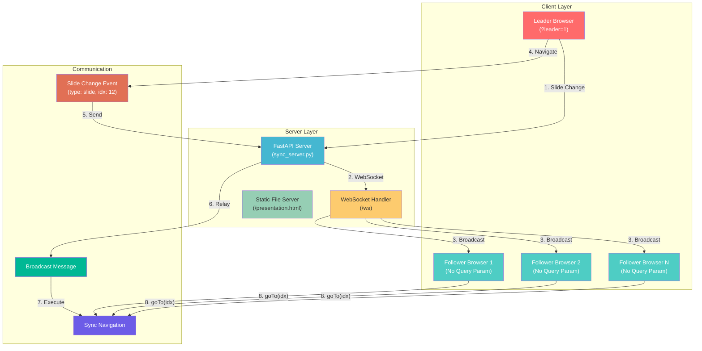

# 📡 ClickHouse Presentation + Live Sync

A single-file interactive presentation about database concepts through ClickHouse, paired with a lightweight FastAPI server that synchronizes the current slide across multiple displays on your local network. One person (the Leader) controls the navigation, and everyone else (Followers) automatically stay in sync.

> ⚠️ **DISCLAIMER:** This presentation is designed for educational purposes to demonstrate ClickHouse concepts, database architecture, and real-time synchronization. All content is for learning and demonstration only.


---

## 📋 Table of Contents

- [Features](#-features)
- [Architecture](#-architecture)
- [Tech Stack](#-tech-stack)
- [Prerequisites](#-prerequisites)
- [Installation](#-installation)
- [Usage](#-usage)
- [Keyboard Shortcuts](#-keyboard-shortcuts)
- [Troubleshooting](#-troubleshooting)
- [Project Structure](#-project-structure)
- [Future Enhancements](#-future-enhancements)
- [License](#-license)

---

## ✨ Features

### 🎯 **Self-Contained Presentation**
- **Single HTML file** (no external dependencies)
- **Prezi-style interactive** presentation
- **Works offline** without any server
- **Full keyboard navigation** support

### 🔄 **Live Sync Across Multiple Screens**
- **Real-time synchronization** via WebSocket
- **Leader/Follower model** (one controls, all follow)
- **Automatic reconnection** (no manual refresh needed)
- **Visual status indicator** (🟢 Leader / 🔵 Follower / ⚪️ Disconnected)

### 🚀 **Lightweight & Fast**
- **Zero dependencies** for the presentation
- **FastAPI server** for minimal overhead
- **WebSocket** for instant updates
- **No database required** (stateless sync)

---

## 🏗️ Architecture



### How It Works

1. **Leader** (with `?leader=1`) navigates through slides
2. **Server** receives slide change via WebSocket
3. **Server broadcasts** the change to all connected Followers
4. **Each Follower** automatically navigates to the same slide
5. **Status indicator** shows connection state in real-time

---

## 🛠️ Tech Stack

| Component | Technology | Version |
|-----------|------------|---------|
| **Server** | FastAPI | 0.100+ |
| **Protocol** | WebSocket | RFC 6455 |
| **Presentation** | HTML/CSS/JS | Native |
| **Python** | Python | 3.9+ |
| **ASGI Server** | Uvicorn | Latest |

---

## 📦 Prerequisites

### System Requirements
- **Python 3.9+** (for running the server)
- **Modern Browser** (Chrome, Firefox, Edge, Safari)
- **Network** (Local network for sync)
- **Port 8000** available (or configurable)

### Network Requirements
- All devices on the **same local network**
- **Firewall access** for port 8000
- **WebSocket support** in browsers

---

## 🚀 Installation

### 1. Clone the Repository

```bash
git clone https://github.com/yourusername/clickhouse-presentation.git
cd clickhouse-presentation
```

### 2. Create Virtual Environment

```bash
# Windows
python -m venv venv
venv\Scripts\activate

# Linux/Mac
python3 -m venv venv
source venv/bin/activate
```

### 3. Install Dependencies

```bash
pip install -r requirements.txt
```

### 4. Verify Installation

```bash
# Check if all dependencies are installed
pip list | grep -E "fastapi|uvicorn|websockets"
```

---

## 🎮 Usage

### Step 1: Find Server IP Address

```bash
# On Linux/Mac
hostname -I

# On Windows
ipconfig

# Look for IP like: 192.168.1.23 (not 127.0.0.1)
```

### Step 2: Start the Server

```bash
uvicorn sync_server:app --host 0.0.0.0 --port 8000
```

Output:
```
INFO:     Started server process [12345]
INFO:     Waiting for application startup.
INFO:     Application startup complete.
INFO:     Uvicorn running on http://0.0.0.0:8000
```

### Step 3: Test Locally

Open browser: `http://localhost:8000/`

### Step 4: Setup Leader (Control Screen)

On your machine (presenter):
```
http://<YOUR_IP>:8000/?leader=1
```

Example: `http://192.168.1.23:8000/?leader=1`

You should see: **🟢 Leader**

### Step 5: Setup Followers (Other Screens)

On each other machine:
```
http://<SERVER_IP>:8000/
```

Example: `http://192.168.1.23:8000/`

They should see: **🔵 Follower**

### Step 6: Start Presenting!

- Use arrow keys, Space, or numbers to navigate
- All Followers will sync automatically
- No manual refresh needed (auto-reconnect)

---

## ⌨️ Keyboard Shortcuts

| Key | Action | Sync Behavior |
|-----|--------|---------------|
| `→` `↓` `Space` | Next Slide | ✅ Sync |
| `←` `↑` | Previous Slide | ✅ Sync |
| `Home` | First Slide | ✅ Sync |
| `End` | Last Slide | ✅ Sync |
| `N` + `Enter` | Jump to slide N | ✅ Sync |
| `M` | Overview Mode | ✅ Sync |
| `B` | Black Screen | ✅ Sync |
| `W` | White Screen | ✅ Sync |
| `H` | Show Help | ❌ Local Only |
| `Esc` | Exit Any Mode | ✅ Sync |

---

## 🛠️ Troubleshooting

### Presentation Not Loading

```bash
# Check if server is running
curl http://localhost:8000

# Check port availability
sudo netstat -tulpn | grep 8000
```

### Sync Not Working

| Symptom | Solution |
|---------|----------|
| ⚪️ Always disconnected | Check firewall: `sudo ufw allow 8000` |
| 🔵 Connected but no sync | Ensure only ONE Leader (`?leader=1`) |
| 🔴 Connection refused | Wrong IP address - check `hostname -I` |
| ⚠️ Multiple Leaders | Close extra leader tabs |

### Firewall Configuration

```bash
# On Ubuntu/Debian
sudo ufw allow 8000/tcp

# On CentOS/RHEL
sudo firewall-cmd --permanent --add-port=8000/tcp
sudo firewall-cmd --reload

# On Windows
# Control Panel > Windows Defender Firewall > Inbound Rules
```

### After Modifying `presentation.html`

```bash
# No server restart needed!
# Just refresh browser (F5) on all screens
```

---

## 📁 Project Structure

```
clickhouse-presentation/
│
├── presentation.html          # Self-contained presentation
├── sync_server.py             # FastAPI + WebSocket server
├── requirements.txt           # Python dependencies
├── LICENSE                    # MIT License
└── README.md                  # This file
```

---

## 🚀 Future Enhancements

- [ ] **"Take Over" Button** - Switch Leader between presenters
- [ ] **Chat/Questions** - Audience feedback during presentation
- [ ] **Recording** - Auto-record presentation for later playback
- [ ] **PDF Export** - Download presentation as PDF
- [ ] **Timer** - Built-in presentation timer
- [ ] **Private Mode** - Password-protected sessions
- [ ] **Mobile Controls** - Use phone as remote control

---

## 📝 License

This project is licensed under the MIT License - see the [LICENSE](LICENSE) file for details.

---

## 👤 Author

**Seyed Mohammad Javad Hosseini**
- GitHub: [@javad-hosseini](https://github.com/javad-hosseini)
- LinkedIn: [seyed-mohammad-javad-hosseini](https://www.linkedin.com/in/seyed-mohammad-javad-hosseini-b52962280/)

---

## 🙏 Acknowledgments

- **FastAPI** - Modern web framework
- **WebSocket** - Real-time communication
- **ClickHouse** - Inspiration for the presentation content

---

## ⭐ Support

Give a ⭐️ if this project helped you!

---

**🎯 Delivered with ❤️ for seamless presentations** 🚀
